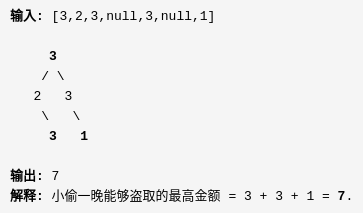
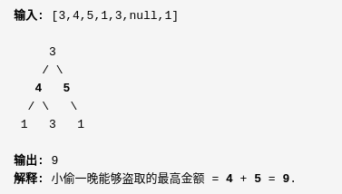

##LeetCode 337 打家劫舍3
####Description:
在上次打劫完一条街道之后和一圈房屋后，小偷又发现了一个新的可行窃的地区。这个地区只有一个入口，我们称之为“根”。 除了“根”之外，每栋房子有且只有一个“父“房子与之相连。一番侦察之后，聪明的小偷意识到“这个地方的所有房屋的排列类似于一棵二叉树”。 如果两个直接相连的房子在同一天晚上被打劫，房屋将自动报警。
计算在不触动警报的情况下，小偷一晚能够盗取的最高金额。

####Example:

####Hint:
* 方案 动态规划
> dp[n] 的 含义是从当前节点开始打劫可获得的最大金额  
> 两种情况：  
> {
>   第n个房间挖:dp(n) = f(n) + Sum(f(n.l.l), f(n.l.r), f(n.r.l), f(n.r.r))  
>   第n个房间不挖:dp(n) = Sum(dp(n.l), dp(n.r))
> }
> 状态转移方程 dp(n) = Max(Sum(dp(n.l), dp(n.r)), 
>  f(n) + Sum(f(n.l.l), f(n.l.r), f(n.r.l), f(n.r.r)))
