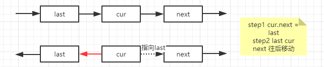
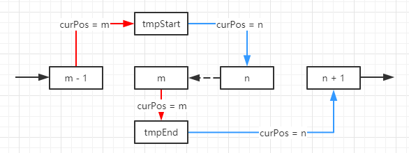
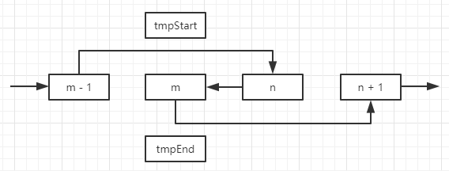

##LeetCode 92 反转链表 II
####Description:
>反转从位置 m 到 n 的链表。请使用一趟扫描完成反转。  
说明：  
1 <= m <= n <= 链表长度。  
####Example:
>输入:1->2->3->4->5->NULL, m = 2, n = 4   
输出:1->4->3->2->5->NULL  
####Hint:
>* 定义 lastNode curNode nextNode 三个节点来完成指针变化的过程  

>* 定义 tmpStart tmpEnd tmpStartBefore tmpEndBefore 四个临时节点  

>* 遍历完成后删除 tmpStart tmpEnd 临时节点  

***
####剪枝条件：  
>* m = n 可直接返回head
>* 当前位置大于n时可结束遍历